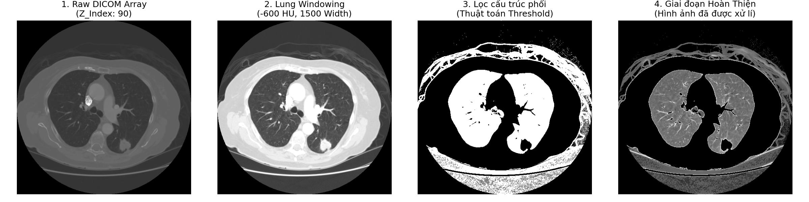
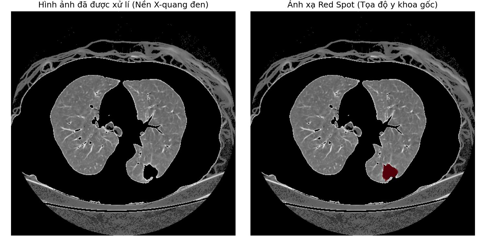

<h1 align="center">Hệ Thống Xử Lý Ảnh Y Tế DICOM 🚀</h1>

<p align="center">
  <strong>Hệ thống Tiền xử lý Dữ liệu Y tế (CT Scans) & Trực quan hoá Đa chiều</strong><br>
  <em>(Đồ án 1 - Xử lý Khối u Phổi với chuẩn LIDC-IDRI)</em>
</p>

## 🖼️ Mẫu Đầu Ra (Output Visuals)
Dưới đây là một số hình ảnh xử lý tự động của hệ thống đối với một hồ sơ bệnh nhân tiêu biểu. Hệ thống hoạt động theo dây chuyền tịnh tiến giúp bóc tách từng lớp nhiễu của ảnh chụp X-Quang thành cấu trúc bề mặt rõ ràng:

### Bước 1: Tiền Xử Lý (Image Preprocessing)
Tiến hành loại bỏ các vùng nhiễu (mỡ, mô thừa) nằm ngoài vùng phổi.


### Bước 2: Đối chiếu Chuyên gia (Ground Truth Mapping)
Ánh xạ tọa độ Nodule thực tế (được bác sĩ chẩn đoán) thông qua thư viện Pylidc lên vùng Phổi vừa được làm sạch để đánh giá hệ thống.


### Bước 3: Dựng Không Gian 3D (Object Rendering)
Tọa độ được nén qua thuật toán Marching Cubes để xuất ra vật thể ảo `.obj` nguyên khối (sẵn sàng nhúng lên PowerPoint).

---

## 🛠 Cấu trúc Mã Nguồn (Source Code)
Mã nguồn được thiết kế dưới cấu trúc Master Pipeline phân tách Module hóa:

- `src/utils.py`: Bộ thư viện dùng chung chứa cơ chế thu thập dữ liệu (DICOM loading), toán học lọc độ X-Quang (HU), Cửa sổ hóa (Windowing).
- `src/step1_preprocess.py`: Tìm lát cắt Z chứa khối u từ Pylidc và tự động xả mỡ/xương.
- `src/step2_redspot.py`: Nhúng tọa độ y án bác sĩ đính kèm lên hình bằng phương thức Masking Đỏ chuẩn hóa.
- `src/step3_3d_scale.py`: Sử dụng thuật toán Marching Cubes, tạo lưới đa giác (Vertices/Faces) xuất thành `.obj`.
- `src/run_storyline.py`: File Tổng. Quét kho dữ liệu và thực thi theo dây chuyền Batch Processing cho hàng loạt bệnh nhân.

## ⚙️ Cài Đặt (Installation)
**1. Tải môi trường (Setup Environment)**
```bash
git clone https://github.com/hdung274/HCMUT-Proj1-AI_DICOM.git
cd HCMUT-Proj1-AI_DICOM
pip install -r requirements.txt
```

**2. Chuẩn bị dữ liệu (Dataset)**
Hệ thống yêu cầu CSDL `LIDC-IDRI`. Hãy bỏ các thư mục y tế DICOM vào thư mục `data/` trong Source Code gốc. 

**3. Khởi chạy Dây chuyền (Run Master Script)**
```bash
python src/run_storyline.py
```
*(Tất cả kết quả sẽ tự động lưu vào thư mục `output/` sau khi kết thúc).*

---
<br><br>

<h1 align="center">🇺🇸 English View</h1>

<p align="center">
  <strong>Medical Data Preprocessing & Multidimensional Visualization System</strong><br>
  <em>(Thesis Project 1 - Lung Nodule Processing with LIDC-IDRI standard)</em>
</p>

## 🖼️ Output Previews
Below is the automated processing sequence of the system for a typical patient profile. The pipeline progressively peels away noise and bodily tissues to isolate crucial lung structures:

### Step 1: Preprocessing
Removes extraneous noise (fat, excess tissue) outside the lung region to create a clean mask.


### Step 2: Ground Truth Mapping
Maps the actual diagnosed coordinates of the Nodule (via Pylidc library) onto the cleaned Lung region.


### Step 3: 3D Scale Rendering
Coordinates are compiled through the Marching Cubes algorithm and exported into a unified `.obj` solid model (ready for PowerPoint integration).

---

## 🛠 Source Architecture
The source code follows a highly modularized architecture:

- `src/utils.py`: Contains common libraries for DICOM fetching, X-Ray Hounsfield Unit filtering, and Windowing algorithms.
- `src/step1_preprocess.py`: Targets the specific Z-Slice containing the tumor and applies automated thresholding.
- `src/step2_redspot.py`: Highlights the Ground Truth coordinates provided by medical professionals.
- `src/step3_3d_scale.py`: Utilizes Marching Cubes to cast multidimensional Vertices/Faces into `.obj`.
- `src/run_storyline.py`: The Main Orchestrator. Queries the data hub and executes batch processing across the patient base.

## ⚙️ Installation
**1. Setup Environment**
```bash
git clone https://github.com/hdung274/HCMUT-Proj1-AI_DICOM.git
cd HCMUT-Proj1-AI_DICOM
pip install -r requirements.txt
```

**2. Prepare the Dataset**
The pipeline requires the `LIDC-IDRI` dataset. Place your raw DICOM directories inside the root `data/` folder. 

**3. Run the Master Script**
```bash
python src/run_storyline.py
```
*(All generated contents will automatically be segregated by Patient ID and exported to the `output/` directory upon completion).*
